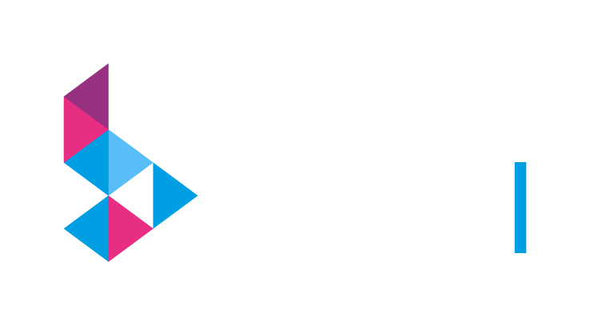

# 2nd TempXAI Workshop for Explainable AI in Time Series and Data Streams

The workshop focuses on exploring the crucial intersection of Explainable AI (XAI) and the challenges posed by time series and data streams.
Our primary objectives include understanding dynamic interpretability, delving into techniques that offer transparent insights into time-evolving data, and providing a better understanding of machine learning models in dynamic environments. 
We aim to advance incremental explainability by investigating methods that ensure interpretability remains effective as models adapt to changing data over time or methods that are able to explain these changes. 
Moreover, we seek to promote real-time decision-making by exploring applications of XAI in real-time decision-making scenarios, addressing the need for interpretable models in time-sensitive contexts. 
The workshop also aims to share practical insights by encouraging the sharing of novel XAI tools that are specific to time series and data streams, in addition to case studies and practical implementations in employing interpretable machine learning for time series and data streams. 

The XAI for time series and data streams workshop welcomes papers that cover, but are not limited to, one or several of the following topics:

- Explainable AI methods for time series modeling
- Explainable AI methods for data streams and models in flux
- Interpretable machine learning algorithms for time series and data streams
- Explainable deep learning for time series and data stream modeling
- Explainable concept drift detection in time series and data streams
- Explainable anomaly detection in time series or data streams
- Explainability methods for autoregressive transformer models
- Explainable pattern discovery and recognition in time series
- Explainability methods for multivariate time series
- Explainable time series features engineering
- Explainable aggregation of time series
- Integration of domain knowledge in time series modeling
- Explainability for continual learning and domain adaptation
- Visual explanations for (long) temporal data
- Causality; Stochastic process modeling
- Explainability metrics and evaluation, including benchmark time series and streaming datasets
- Case studies and applications of explainable artificial intelligence for time series or data streams
- Regulatory compliance and ethics

We welcome submissions of regular papers (max. 8-16 pages) and extended abstracts (up to 2-4 pages). Each paper will be double-blind peer-reviewed and, upon selection, be presented and discussed at the workshop. 
For extended abstracts, works-in-progress or industrial experiences are welcome. 
We also welcome submissions of position papers (2 pages) presenting novel ideas, perspectives, or challenges in explainable AI for time series and data streams. 
**At least one author of each accepted paper must be registered to the conference and attend to the workshop.**
The workshops will be published as in a joint post-workshop proceeding published by Springer Communications in Computer and Information Science. Please format your papers according to the one-column Springer LNCS template [found here](https://ecmlpkdd-storage.s3.eu-central-1.amazonaws.com/2025/ECML_PKDD_2025_Author_Kit.zip).

# Important dates
- **Paper Submission**: Saturday, June 14, 2025
- **Author Notification**: Monday, July 14, 2025
- **Camera Ready**: To be announced.
- **Workshop**: To be announced.

The workshop will comprise paper presentations, discussions, and invited talks.
In case of many submissions, a poster session may also be included.

# Keynote speaker
- To be announced

# Organizers
<table style="width: 100%; display: grid; grid-template-columns: repeat(auto-fill, minmax(500px, 1fr)); gap: 50px;">
    <tr>
        <td style="text-align: center; border: none;">
            
            
Zahraa S. Abdallah

            
University of Bristol

        </td>
        <td style="text-align: center; border: none;">
            
            
Matthias Jakobs

            
TU Dortmund University

        </td>
        <td style="text-align: center; border: none;">
            
            
Panagiotis Papapetrou

            
Stockholm University

        </td>
    </tr>
    <tr>
        <td style="text-align: center; border: none;">
            
            
Amal Saadallah

            
TU Dortmund University

        </td>
        <td style="text-align: center; border: none;">
            
            
George Tzagkarakis

            
FORTH-ICS

        </td>
    </tr>
</table>

# Program Committee (tentative)
- To be announced

# Sponsors
<table style="width: 100%; display: grid">
    <tr>
        <td style="text-align: center; border: none;">
            
        </td>
        <td style="border: none;">
        This workshop is supported by the Federal Ministry of Education and Research of Germany and the state of North Rhine-Westphalia as part of the Lamarr Institute for Machine Learning and Artificial Intelligence.
        </td>
    </tr>
    <tr>
        <td style="text-align: center; border: none;">
            
        </td>
        <td style="border: none;">
        </td>
    </tr>
</table>

